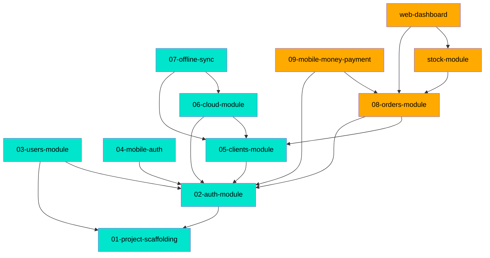

# MDD Connections Map — EZVIZ Sénégal

## Path Tree

```
Clients
└── 05-clients-module                        complete

Cloud
└── 06-cloud-module                          complete

Commerce
├── Orders
│   └── 08-orders-module                     in_progress
└── Payments
    └── 09-mobile-money-payment              in_progress

Core
├── Auth
│   └── 02-auth-module                       complete
└── Users
    └── 03-users-module                      complete

Foundation
└── Scaffolding
    └── 01-project-scaffolding               complete

Mobile
├── Auth
│   └── 04-mobile-auth                       complete
└── OfflineSync
    └── 07-offline-sync                      complete

(no path)
├── stock-module   [10-stock-module.md]      in_progress  ⚠ missing path
└── web-dashboard  [11-web-dashboard.md]     in_progress  ⚠ missing path
```

## Dependency Graph



## Source File Overlap

Files referenced by 2 or more docs:

| Source File | Referenced By |
|---|---|
| `apps/backend/prisma/schema.prisma` | 01-project-scaffolding, 05-clients-module, 06-cloud-module, 08-orders-module |
| `apps/backend/src/app.module.ts` | 05-clients-module, 06-cloud-module |
| `apps/mobile/App.tsx` | 01-project-scaffolding, 07-offline-sync |

## Warnings

| # | Severity | Doc | Issue |
|---|---|---|---|
| 1 | ⚠ | 10-stock-module.md | Missing `path` field — run `/mdd update 10` to add |
| 2 | ⚠ | 11-web-dashboard.md | Missing `path` field — run `/mdd update 11` to add |
| 3 | ⚠ | 10-stock-module.md | Missing `source_files` field |
| 4 | ⚠ | 11-web-dashboard.md | Missing `source_files` field |
| 5 | ✅ | 11-web-dashboard.md | `depends_on` fixed: `stock-module` (was `10-stock-module`) |
