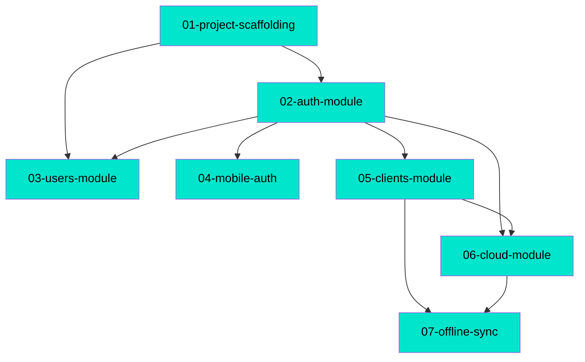

# MDD Connections Map

## Path Tree

```
Both/
  ├── Scaffolding       01-project-scaffolding  complete
  └── Clients           05-clients-module       complete
Cloud/
  └── Subscriptions     06-cloud-module         complete
Core/
  ├── Auth              02-auth-module          complete
  └── Users             03-users-module         complete
Mobile/
  ├── Auth              04-mobile-auth          complete
  └── OfflineSync       07-offline-sync         complete
```

## Dependency Graph



## Source File Overlap

Files referenced by 2+ feature docs:

| File | Referenced by |
|------|---------------|
| `apps/backend/src/app.module.ts` | 01-project-scaffolding, 05-clients-module, 06-cloud-module |
| `apps/backend/prisma/schema.prisma` | 01-project-scaffolding, 05-clients-module, 06-cloud-module |
| `apps/mobile/src/navigation/AppNavigator.tsx` | 04-mobile-auth, 05-clients-module, 06-cloud-module |

## Warnings

(none — all depends_on references resolve, no circular dependencies, all docs have path field)
